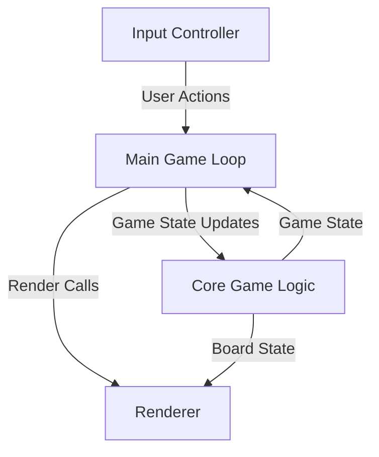
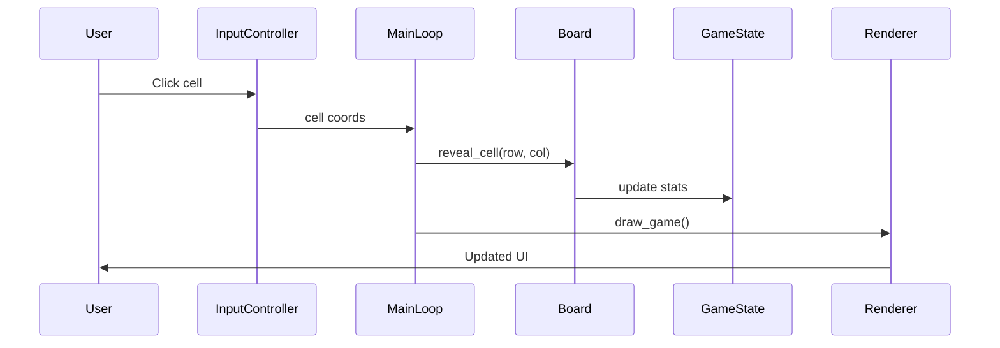

# ARCHITECTURE.md

"""
Module: ARCHITECTURE.md
Description: System architecture overview documentation for the Minesweeper project.
Author: Tuan Vu
Creation Date: September 11, 2025
External Sources: N/A - Original Code
"""

# System Architecture: Minesweeper

## 1. Overview

Minesweeper is a single-player puzzle game developed for EECS 581 Project 1. The application presents a 10x10 grid where users uncover cells to reveal numbers indicating adjacent mines, while avoiding detonating any mines. Key features include:

- User-specified mine count (10–20)
- Safe first click (no mine on first cell or its neighbors)
- Flagging suspected mines
- Recursive uncovering of empty cells
- Intuitive graphical interface with status indicators
- Win by revealing all non-mine cells; loss by detonating a mine

## 2. High-Level Architecture

The system follows a **Model-View-Controller (MVC)** pattern:

- **Model:** Core game logic and state management
- **View:** Rendering engine for UI and game board
- **Controller:** Input handling and event coordination

## 3. Component Breakdown

### Core Game Logic (`core/board.py`, `core/cell.py`, `core/gamestate.py`)

- **Responsibility:** Manages the game board, cell states, mine placement, and win/loss logic.
- **Key Functionality:**
  - `Board.place_mines(safe_row, safe_col)`: Randomly places mines, avoiding the first click and its neighbors.
  - `Board.reveal_cell(row, col)`: Reveals a cell, triggers recursive reveal for empty cells.
  - `Board.toggle_flag(row, col)`: Flags or unflags a cell.
  - `Board.is_game_won()`: Checks if all non-mine cells are revealed.
  - `Cell`: Tracks mine, flag, reveal state, and adjacent mine count.
  - `GameState`: Tracks game status, mine count, flags left, and statistics.
- **Interactions:** Receives commands from the controller, updates state, and notifies the view for rendering.

### Input Controller (`input_output/input_controller.py`)

- **Responsibility:** Handles all user input (mouse, keyboard) and translates it into game actions.
- **Key Functionality:**
  - `handle_events()`: Processes Pygame events and dispatches actions.
  - `handle_cell_click(row, col, is_right_click)`: Handles cell reveal or flagging.
  - `get_cell_from_mouse(mouse_pos)`: Maps mouse position to grid coordinates.
- **Interactions:** Communicates user actions to the main game loop and core logic.

### Renderer (`input_output/renderer.py`)

- **Responsibility:** Draws the game board, UI elements, and status screens.
- **Key Functionality:**
  - `draw_game()`: Renders the entire game interface.
  - `draw_cell(row, col)`: Draws individual cells based on their state.
  - `draw_info_panel()`: Displays game status, mine count, and instructions.
  - `draw_start_screen()`, `draw_end_screen()`: Renders start and end overlays.
- **Interactions:** Receives board and game state from the model, updates visuals in response to state changes.

### Main Game Loop (`minesweeper.py`)

- **Responsibility:** Orchestrates the flow between input, logic, and rendering.
- **Key Functionality:**
  - Initializes game components
  - Runs the main event loop
  - Coordinates updates and rendering
- **Interactions:** Central hub connecting controller, model, and view.

## 4. Data Flow

**Scenario:** User clicks a cell to reveal it

**Steps:**

1. User clicks on a cell in the UI.
2. Input Controller translates the mouse position to grid coordinates.
3. Controller calls `handle_cell_click(row, col, is_right_click=False)`.
4. Core Game Logic (`Board.reveal_cell`) updates the board state.
5. GameState updates statistics and checks win/loss conditions.
6. Renderer redraws the board and UI to reflect changes.

**Diagram:**

## 5. Key Data Structures

### Board Grid

- **Structure:** 2D array (`self.grid`) of `Cell` objects (10x10)
- **Purpose:** Represents the game board and each cell's state
- **Key Fields:**
  - `is_mine`: Boolean, true if cell contains a mine
  - `is_flagged`: Boolean, true if cell is flagged
  - `is_revealed`: Boolean, true if cell is uncovered
  - `adjacent_mines`: Integer, number of adjacent mines

### GameState

- **Structure:** Object tracking overall game status and statistics
- **Purpose:** Maintains current game status, mine count, flags left, and revealed cells
- **Key Fields:**
  - `status`: Enum (`PLAYING`, `WON`, `LOST`)
  - `mine_count`: Integer, total mines
  - `flags_left`: Integer, remaining flags
  - `cells_revealed`: Integer, number of revealed cells

## 6. How to Extend the System

### Architectural Principles

- Maintain clear separation between game logic (model), rendering (view), and input (controller)
- Keep board state and game state updates in the model; avoid direct UI manipulation from logic
- Use event-driven updates for responsiveness

### Example Extension: High-Score Leaderboard

To add a leaderboard feature:

- **New Component:** Create a `Leaderboard` module to store and display scores
- **Modify:**
  - Update `GameState` to record completion time and win status
  - Update `Renderer` to display leaderboard on the end screen
  - Update main loop to save scores after each win
- **Interactions:** Leaderboard reads from and writes to persistent storage, interacts with Renderer for display

---

This document provides a comprehensive overview for new developers to understand, maintain, and extend the Minesweeper system. For further details, refer to code comments and module docstrings throughout the project.
